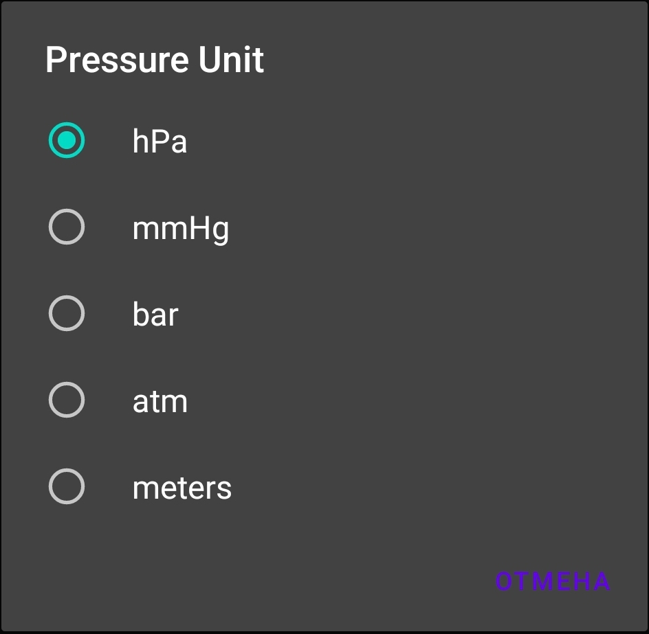

# BaroSense - Atmospheric Pressure Monitor


## 📌 Description
BaroSense is an Android application that transforms your device into a precision barometer. It utilizes your phone's built-in pressure sensor to provide real-time atmospheric data with beautiful visualizations and customizable units.

## 🌟 Key Features
- **Real-time pressure monitoring** with sensor updates (configurable interval)
- **Multiple unit conversions**:
  - hPa (hectopascals)
  - mmHg (millimeters of mercury)
  - bar
  - atm (atmospheres)
  - meters (altitude approximation)
- **Interactive gauge** with animated needle
- **Historical data graph** (last 100 readings)
- **Dark/Light theme** support
- **Configurable update frequency**

## 📸 Screenshots

| Main Screen | Settings | Settings pressure unit | Settings update interval |
|-------------|----------|------------------------|--------------------------|
|  |  |  |  |

*(Replace with your actual screenshot paths)*

## 🛠 Technical Implementation
- **Language**: 100% Kotlin
- **Architecture**: Single Activity with multiple Fragments
- **Components**:
  - SensorManager for pressure data
  - Custom View for gauge visualization
  - MPAndroidChart for graph rendering
  - PreferenceFragment for settings
- **Minimum SDK**: 21 (Android 5.0 Lollipop)

## 📊 Sensor Requirements
Your device must have:
- Hardware barometer (most modern smartphones include this)
- Android 5.0+ OS

To check sensor availability:
```kotlin
val sensorManager = getSystemService(Context.SENSOR_SERVICE) as SensorManager
val hasBarometer = sensorManager.getDefaultSensor(Sensor.TYPE_PRESSURE) != null
```

## ⚙️ Configuration
Customize via Settings:
- Pressure units (hPa/mmHg/bar/atm/m)
- Update frequency (500ms/1s/2s)
- Theme (Light/Dark/System)

## 📈 Data Interpretation
- Standard sea-level pressure: **1013.25 hPa**
- Pressure decreases ~1 hPa per 8 meters altitude gain
- Rapid drops may indicate approaching storms

## 🚀 Future Enhancements
- [ ] Export data to CSV
- [ ] Weather prediction algorithms
- [ ] Wear OS companion app
- [ ] Cloud sync between devices

## 📜 License  
   This project is licensed under the MIT License - see the [LICENSE](LICENSE) file for details.

## 🙏 Acknowledgements
- Material Components for Android
- MPAndroidChart library
- Android Sensor API